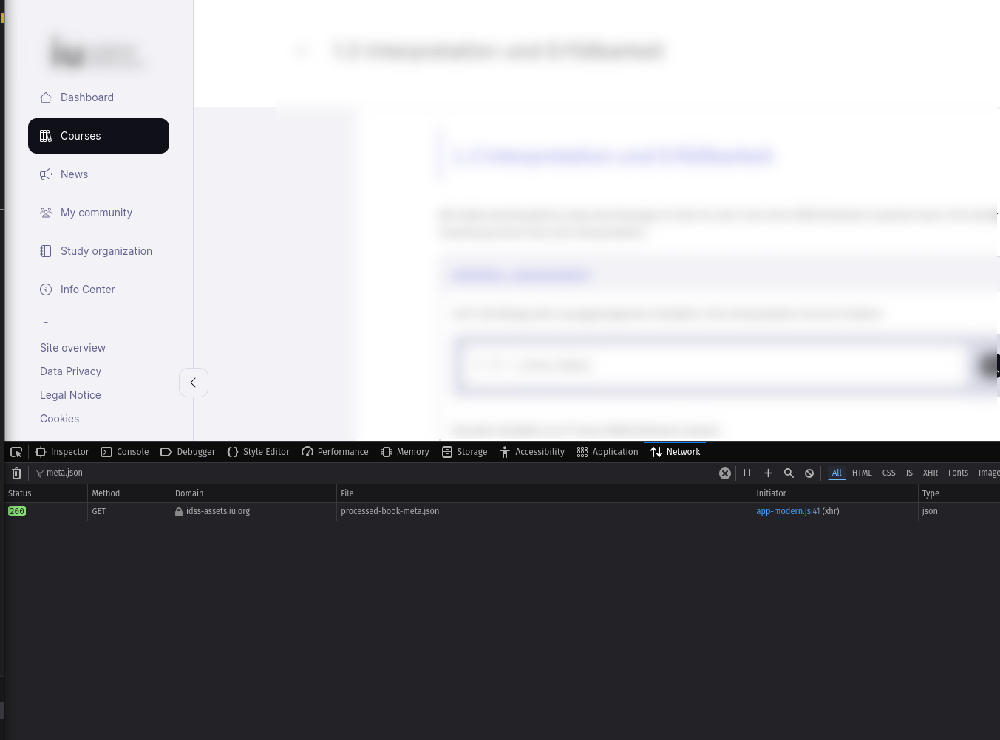

# Lecture Audio Downloader


A Python script to download lecture audio files with proper ID3 tags and optional cover art.

## Features

- Downloads lecture audio files from IU.org
- Adds ID3 tags (title, album, track number)
- Supports cover art images
- Can create a ZIP archive of downloaded files
- Preserves lecture numbering in filenames
- Uses Firefox cookies for authentication

## Requirements

```python
pip install -r requirements.txt
```

## Usage

```sh
python download_lectures.py metadata_url [--output-folder FOLDER] [--zip] [--img IMAGE_PATH]
```

### Arguments

- `metadata`: URL or path to metadata JSON file (required)
- `--output-folder`: Directory to save audio files (default: ./audio)
- `--zip`: Create ZIP archive of downloaded files
- `--img`: Path to cover art image file

## Getting the Metadata URL

1. Open the lecture page in Firefox
2. Right-click and select "Inspect Element" (or press F12)
3. Go to the "Network" tab
4. Look for a request that loads the lecture JSON data (filter for meta.json) (The file should be named processed-book-meta.json)
5. Right-click the request and select "Copy URL"



## Example

```sh
python3 download_lectures.py https://example.iu.org/processed-book-meta.json --img cover.jpg --zip
```

This will:
1. Download all lecture audio files
2. Add ID3 tags with cover art
3. Create a ZIP file with all MP3s
4. Clean up the temporary files

Note: You must be logged into IU.org in Firefox before running the script.